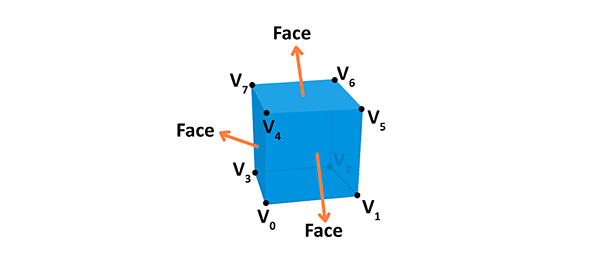

Za početak, potrebno je da savladamo osnovne geometrijske pojmove na srpskom i engleskom.

## Vrste linija

* **Linija** ili **prava** (*line*) je neograničena prava linija
* **Poluprava** ili **zrak** (*ray*) je prava linija ograničena tačkom sa jedne strane
* **Duž** (*line segment*) je prava linija ograničena tačkama sa obe strane

## Vrh (*vertex*)

Tačka u 3D koordinatnom sistemu zove se vrh (*vertex*). Svaki vrh u 3D grafici ima sledeće atribute:

- **Položaj**: Identifikuje tačku u 3D prostoru (x, y, z).  
- **Boja**: Sadrži RGBA vrednosti u opsegu od 0.0 do 1.0.  
- **Normala** (*normal*): Opisuje pravac u kojem je vrh okrenut.  
- **Tekstura**: Dvodimenzionalna slika koju vrh može koristiti za dekoraciju površine kojoj pripada.  

## Lice (*face*)

Lice je ravan između vrhova. Na primer, kocka ima 8 različitih vrhova (tačaka) i 6 različitih lica, svako sastavljeno od 4 vrha. Normala definiše u kojem pravcu je lice okrenuto. Povezivanjem vrhova stvaramo ivice kocke. 

Geometrija je izgrađena od vrhova i lica, dok je materijal tekstura koja koristi boju ili sliku. Kad povežemo geometriju sa materijalom, dobijamo *mesh*.

